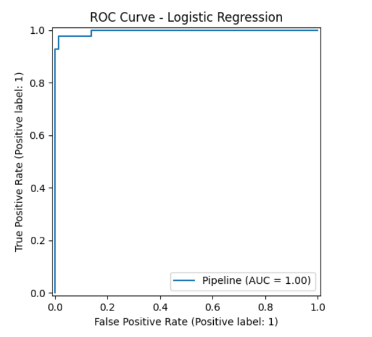
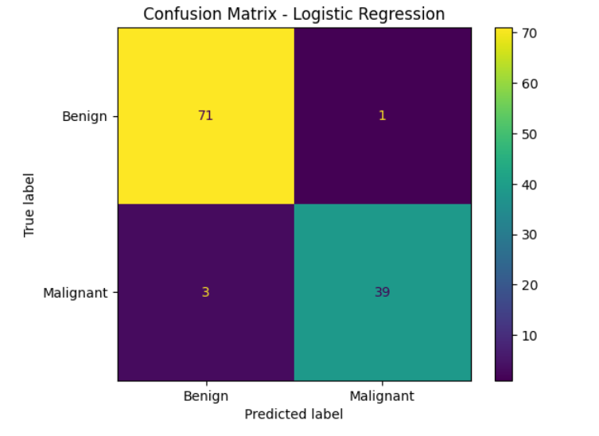
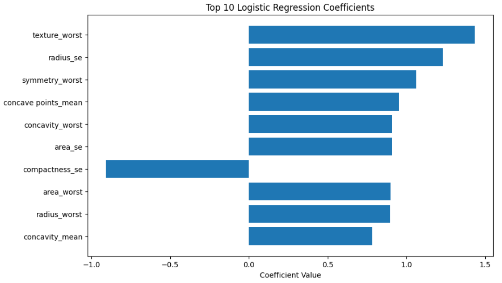
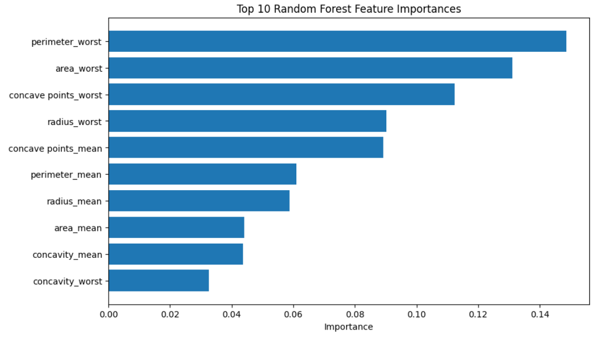
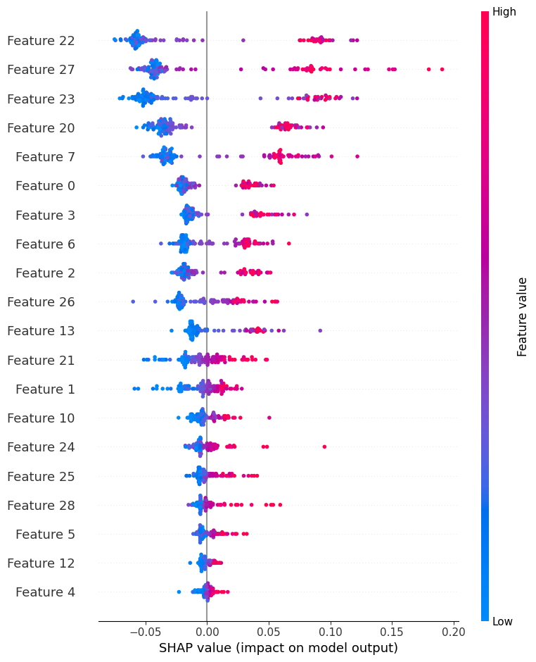
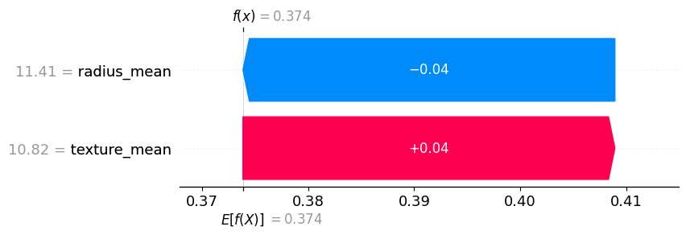
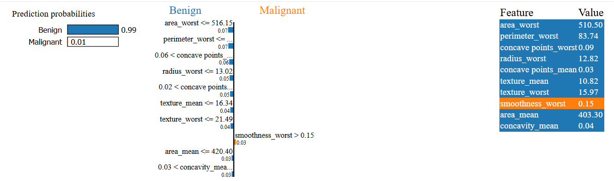

# Breast Cancer Diagnosis Prediction Using Machine Learning and Explainable AI


An advanced **machine learning-based breast cancer diagnosis prediction system** built using multiple classification algorithms and enhanced with **Explainable AI (XAI)** techniques such as **SHAP** and **LIME**.

This project predicts whether a breast tumor is **malignant** or **benign** based on features extracted from breast mass images and provides interpretable explanations for model predictions.

---

## Table of Contents

- [Overview](#overview)
- [Dataset](#dataset)
- [Project Workflow](#project-workflow)
- [Models Used](#models-used)
- [Model Performance](#model-performance)
- [Cross-Validation Results](#cross-validation-results)
- [Best Model Summary](#best-model-summary)
- [Explainable AI (XAI)](#explainable-ai-xai)
- [Screenshots](#screenshots)
- [Project Structure](#project-structure)
- [Installation](#installation)
- [How to Run](#how-to-run)
- [Example Prediction](#example-prediction)
- [Future Improvements](#future-improvements)
- [Disclaimer](#disclaimer)
- [Author](#author)

---

## Overview

Breast cancer is one of the most important medical diagnosis problems, where early and accurate detection can support better treatment decisions. This project applies machine learning models to classify tumors as **malignant** or **benign** using the **Breast Cancer Wisconsin Diagnostic Dataset**.

The project was upgraded from a basic logistic regression implementation into a more advanced and interpretable ML system with:

- proper preprocessing
- multiple model comparison
- ROC-AUC based evaluation
- cross-validation
- confusion matrix and ROC visualization
- SHAP and LIME explainability

---

## Dataset

This project uses the **Breast Cancer Wisconsin Diagnostic Dataset**.

### Target Variable
- `diagnosis`
  - `M` → Malignant
  - `B` → Benign

### Preprocessing
- Dropped unnecessary columns:
  - `id`
  - `Unnamed: 32`
- Encoded diagnosis:
  - `M = 1`
  - `B = 0`
- Applied train-test split with stratification
- Used scaling where required for models like Logistic Regression and SVM

---

## Project Workflow

1. Load dataset
2. Drop irrelevant columns
3. Encode target labels
4. Split data into training and testing sets
5. Build multiple ML models
6. Train and evaluate models
7. Compare metrics using accuracy, precision, recall, F1-score, and ROC-AUC
8. Apply cross-validation
9. Select the best model based on ROC-AUC
10. Generate confusion matrix and ROC curve
11. Add explainability using coefficients, SHAP, and LIME
12. Save the best trained model

---

## Models Used

The following machine learning models were used:

- Logistic Regression
- Support Vector Machine (SVM)
- Decision Tree
- Random Forest
- Gradient Boosting

---

## Model Performance

### Test Set Results

| Model | Accuracy | Precision | Recall | F1-Score | ROC-AUC |
|------|---------:|----------:|-------:|---------:|--------:|
| Logistic Regression | 0.9649 | 0.9750 | 0.9286 | 0.9512 | 0.9960 |
| SVM | 0.9737 | 1.0000 | 0.9286 | 0.9630 | 0.9947 |
| Decision Tree | 0.9123 | 0.9444 | 0.8095 | 0.8718 | 0.8770 |
| Random Forest | 0.9649 | 1.0000 | 0.9048 | 0.9500 | 0.9947 |
| Gradient Boosting | 0.9649 | 1.0000 | 0.9048 | 0.9500 | 0.9947 |

### Classification Report Summary

- **Highest Accuracy:** SVM (`97.37%`)
- **Highest ROC-AUC:** Logistic Regression (`0.9960`)
- **Highest Precision:** SVM / Random Forest / Gradient Boosting (`1.0000`)
- **Best Model Based on ROC-AUC:** Logistic Regression

---

## Cross-Validation Results

| Model | Mean ROC-AUC | Std |
|------|-------------:|----:|
| Logistic Regression | 0.9953 | 0.0053 |
| SVM | 0.9945 | 0.0060 |
| Gradient Boosting | 0.9927 | 0.0041 |
| Random Forest | 0.9905 | 0.0068 |
| Decision Tree | 0.9152 | 0.0367 |

---

## Best Model Summary

Based on the experimental results:

- **Highest Test Accuracy:** SVM (`0.9737`)
- **Highest Test ROC-AUC:** Logistic Regression (`0.9960`)
- **Best Cross-Validation ROC-AUC:** Logistic Regression (`0.9953 ± 0.0053`)

Although SVM achieved the highest accuracy, **Logistic Regression** showed the best overall discrimination performance and cross-validation consistency. Since ROC-AUC is especially important in medical binary classification, Logistic Regression can be considered the most balanced and reliable model for this dataset.

---

## Explainable AI (XAI)

This project includes multiple explainability methods to make model decisions easier to understand.

### 1. Logistic Regression Coefficients
Used for global interpretation of feature importance. The coefficient plot highlights the most influential diagnostic features learned by Logistic Regression.

### 2. Random Forest Feature Importance
Used to identify the most influential features in tree-based learning, such as `perimeter_worst`, `area_worst`, and `concave points_worst`.

### 3. SHAP
Used to explain:
- global feature importance
- sample-wise feature contribution
- dependence of individual features on prediction

### 4. LIME
Used for local explanation of a single sample prediction in a human-readable way, showing which rules pushed the model toward **benign** or **malignant**.

These XAI techniques improve trust and interpretability in medical classification.

---

## Result Analysis

The results show that all models except Decision Tree performed extremely well on the Breast Cancer Wisconsin dataset. SVM achieved the highest test accuracy, while Logistic Regression obtained the best ROC-AUC score on both the test set and cross-validation. Since ROC-AUC is highly important in healthcare classification, Logistic Regression stands out as the most reliable and interpretable model. This makes it especially suitable for Explainable AI analysis.

---

## Screenshots

> Put these images inside a `screenshots/` folder in your GitHub repository.

### ROC Curve - Logistic Regression


### Confusion Matrix - Logistic Regression


### Logistic Regression Coefficients


### Random Forest Feature Importance


### SHAP Summary Plot


### SHAP Waterfall Plot


### LIME Explanation


---

## Project Structure

```bash
Breast_Cancer_Prediction_Project/
│
├── Breast_Cancer_Prediction_XAI_Colab.ipynb
├── best_breast_cancer_model.pkl
├── lime_breast_cancer_explanation.html
├── data.csv
├── README.md
└── screenshots/
    ├── confusion_matrix.png
    ├── roc_curve.png
    ├── logistic_regression_coefficients.png
    ├── random_forest_importance.png
    ├── shap_summary.png
    ├── shap_waterfall.png
    └── lime_explanation.png
```

---

## Installation

Clone the repository:

```bash
git clone https://github.com/your-username/Breast_Cancer_Prediction_Project.git
cd Breast_Cancer_Prediction_Project
```

Install required libraries:

```bash
pip install pandas numpy matplotlib scikit-learn shap lime joblib
```

For Google Colab:

```bash
pip install shap lime
```

---

## How to Run

### Run in Google Colab
1. Upload the dataset to your Google Drive
2. Open the notebook in Google Colab
3. Update the dataset path if necessary
4. Run all cells in order
5. Generate model results and XAI outputs
6. Save the best model

### Run Locally
1. Place `data.csv` in the project directory
2. Open the notebook or Python script
3. Run model training and evaluation
4. Generate SHAP and LIME explanations
5. Save the trained model

---

## Example Prediction

### Output Labels
- `0` → Benign
- `1` → Malignant

### Sample Interpretation
The selected model predicts whether a tumor is malignant or benign based on 30 diagnostic features. SHAP and LIME are used to explain why the model made a specific decision for an individual patient.

In the attached LIME example, the model assigns a very high probability to the **benign** class (`0.99`) and a very low probability to the **malignant** class (`0.01`), with features such as `area_worst`, `perimeter_worst`, and `radius_worst` contributing strongly toward the benign prediction.

---

## Why This Project Is Strong

This project combines:

- machine learning model comparison
- strong medical classification performance
- ROC-AUC based evaluation
- cross-validation
- explainable AI techniques
- practical healthcare relevance

It demonstrates both **technical modeling skill** and **interpretability awareness**, which is especially important in AI for healthcare.

---

## Future Improvements

Possible next upgrades:

- Streamlit web app deployment
- downloadable prediction interface
- hyperparameter tuning with GridSearchCV
- model comparison plots
- PDF report generation
- deployment on Hugging Face Spaces or Streamlit Cloud

---

## Disclaimer

This project is developed for **educational and research purposes only**.  
It is **not intended for real clinical diagnosis or medical decision-making**.

---

## Author

**Tasikul Islam**  
Final-year undergraduate student in Information and Communication Engineering (ICE)  
Daffodil International University

### Interests
- Machine Learning
- Deep Learning
- Computer Vision
- Natural Language Processing
- Research

### Connect
- GitHub: `your-github-link`
- LinkedIn: `your-linkedin-link`
- Email: `your-email@example.com`

---

## Support

If you found this project useful, consider giving it a **star** on GitHub.

