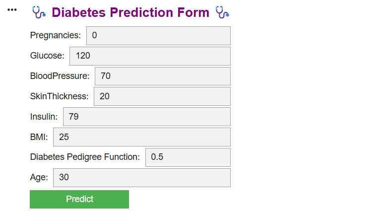
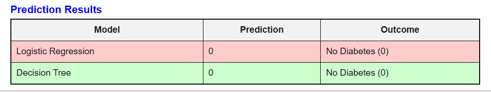
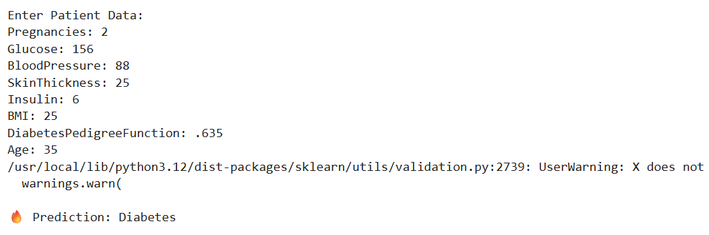
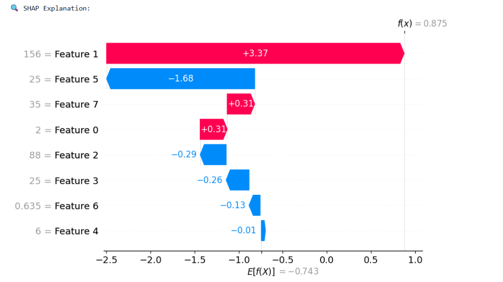
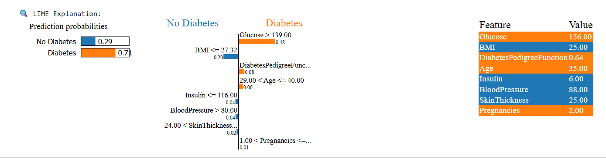

# 🩺 Diabetes Prediction Project

# 🔥 Diabetes Prediction Project with Machine Learning and Explainable AI


An end-to-end **Diabetes Prediction System** built with multiple machine learning models and enhanced with **Explainable AI (XAI)** techniques such as **LIME** and **SHAP**.  
The project predicts whether a patient is likely to have diabetes based on medical features and provides local explanations for individual predictions.

---

## 📌 Overview

This project was developed to explore how machine learning can be applied to a healthcare-related classification problem.  
It combines traditional ML models, ensemble learning, and explainability methods to make predictions more understandable.

The system includes:

- Multiple machine learning classifiers
- Voting-based ensemble learning
- Model evaluation using classification metrics
- Prediction interface for patient data
- Local explanation using **LIME**
- Feature contribution analysis using **SHAP**

---

## 🚀 Features

- Diabetes prediction using patient health data
- Handles invalid zero values as missing values
- Missing value imputation using median strategy
- Feature scaling for Logistic Regression
- Multiple trained ML models:
  - Logistic Regression
  - Decision Tree
  - Random Forest
  - Gradient Boosting
  - XGBoost
- Hard Voting Ensemble model
- Individual patient prediction
- Explainability using:
  - **LIME** for local rule-based explanation
  - **SHAP** for feature contribution visualization
- User input form and prediction results display
- Model saving using `joblib`

---

## 🧠 Models Used

The following classification algorithms were used in this project:

1. **Logistic Regression**
2. **Decision Tree**
3. **Random Forest**
4. **Gradient Boosting**
5. **XGBoost**
6. **Voting Ensemble**

---

## 📂 Dataset

This project uses the **Pima Indians Diabetes Dataset**.

### Input Features
- Pregnancies
- Glucose
- BloodPressure
- SkinThickness
- Insulin
- BMI
- DiabetesPedigreeFunction
- Age

### Target Variable
- `Outcome`
  - `0` = No Diabetes
  - `1` = Diabetes

---

## ⚙️ Preprocessing Steps

The dataset contains some invalid `0` values in medical columns where zero is not realistic.  
These values were treated as missing values and replaced with `NaN`.

### Columns cleaned
- Glucose
- BloodPressure
- SkinThickness
- Insulin
- BMI

### Preprocessing pipeline used
- Missing value handling with `SimpleImputer(strategy="median")`
- Feature scaling with `StandardScaler` for Logistic Regression
- Train-test split with `test_size=0.2`

---

## 📊 Model Performance

Below are the results obtained from the trained models on the test set.

| Model | Accuracy | Precision (Class 1) | Recall (Class 1) | F1-Score (Class 1) |
|------|---------:|--------------------:|-----------------:|-------------------:|
| Logistic Regression | 0.7532 | 0.67 | 0.62 | 0.64 |
| Decision Tree | 0.7078 | 0.57 | 0.76 | 0.65 |
| Random Forest | 0.7468 | 0.65 | 0.62 | 0.64 |
| Gradient Boosting | 0.7597 | 0.66 | 0.69 | 0.67 |
| XGBoost | 0.7468 | 0.62 | 0.73 | 0.67 |
| Voting Ensemble | 0.7403 | Not reported | Not reported | Not reported |

### ✅ Best Accuracy
**Gradient Boosting** achieved the highest test accuracy:

- **Accuracy:** `0.7597`

### ✅ Best Recall for Diabetic Class
**Decision Tree** showed the highest recall for diabetic patients:

- **Recall (Class 1):** `0.76`

This is important because in medical prediction tasks, identifying actual positive cases is often more critical than accuracy alone.

---

## 🔍 Explainable AI (XAI)

This project includes two explainability techniques:

### 1. LIME
LIME explains an individual prediction by showing which input features pushed the prediction toward **Diabetes** or **No Diabetes**.

### 2. SHAP
SHAP visualizes how each feature contributes to the final prediction value.  
It provides a clearer understanding of which features increase or decrease diabetes risk.

---

## 🖼️ Results Screenshot

> Place the images inside a `screenshots/` folder in your GitHub repository.

### Patient Input Form


### Console Prediction Output


### Prediction Results Table


### LIME Explanation


### SHAP Waterfall Plot


---

## 🧪 Example Prediction

### Sample Input
```text
Pregnancies: 2
Glucose: 85
BloodPressure: 126
SkinThickness: 25
Insulin: 6
BMI: 32
DiabetesPedigreeFunction: 0.67
Age: 43
```

### Predicted Output
```text
No Diabetes
```

Another explained prediction example in the screenshots shows a patient profile where the model predicted **Diabetes**, mainly influenced by high **Glucose**.

---

## 🗂️ Project Structure

```bash
Diabetes_Prediction_Project/
│
├── diabetes.csv
├── diabetes_prediction.ipynb
├── app.py
├── imputer.pkl
├── scaler.pkl
├── log_model.pkl
├── tree_model.pkl
├── rf_model.pkl
├── gb_model.pkl
├── xgb_model.pkl
├── ensemble_model.pkl
├── README.md
└── screenshots/
    ├── diabetes_input.png
    ├── diabetes_output.png
    ├── prediction_results.png
    ├── lime_explanation.png
    └── shap_waterfall.png
```

---

## 🛠️ Installation

Clone the repository:

```bash
git clone https://github.com/your-username/Diabetes_Prediction_Project.git
cd Diabetes_Prediction_Project
```

Install the required libraries:

```bash
pip install pandas numpy scikit-learn xgboost lime shap joblib
```

If you are using Google Colab, install extra packages if needed:

```bash
pip install lime shap xgboost
```

---

## ▶️ How to Run

### Option 1: Run in Google Colab
1. Upload the dataset to your Google Drive
2. Mount Google Drive in Colab
3. Update the dataset path if necessary
4. Run the notebook step by step
5. Save the trained models
6. Run the prediction function

### Option 2: Run Locally
1. Place `diabetes.csv` in the project directory
2. Run the notebook or Python script
3. Enter patient data
4. View the final prediction and explanation

---

## 💾 Saved Models

The project saves all trained models and preprocessors as `.pkl` files:

- `imputer.pkl`
- `scaler.pkl`
- `log_model.pkl`
- `tree_model.pkl`
- `rf_model.pkl`
- `gb_model.pkl`
- `xgb_model.pkl`
- `ensemble_model.pkl`

This allows the prediction system to be reused without retraining.

---

## 📌 Important Notes

- The warning about `use_label_encoder` in XGBoost does not affect the final prediction, but the parameter can be removed in future versions.
- The warning about feature names appears because NumPy arrays were passed to a transformer fitted with DataFrame column names.
- For a cleaner production version, using a unified `Pipeline` for each model would be a better improvement.

---

## 🔮 Future Improvements

Possible improvements for the next version:

- Use `Pipeline` for cleaner preprocessing and training
- Add ROC curve and confusion matrix visualizations for all models
- Add feature importance bar charts
- Use soft voting instead of hard voting
- Build a Streamlit web application for deployment
- Tune hyperparameters with GridSearchCV or RandomizedSearchCV
- Deploy on Streamlit Cloud or Hugging Face Spaces

---

## ⚠️ Disclaimer

This project is for **educational and research purposes only**.  
It should **not** be used as a substitute for professional medical diagnosis.

---

## 👨‍💻 Author

**Tasikul Islam**  
📘 Information and Communication Engineering & AI Research
🎓 Daffodil International University

### Interests
- Machine Learning
- Deep Learning
- Computer Vision
- Natural Language Processing
- Research
---

## ⭐ Support

If you found this project helpful, consider giving it a **star** on GitHub.
