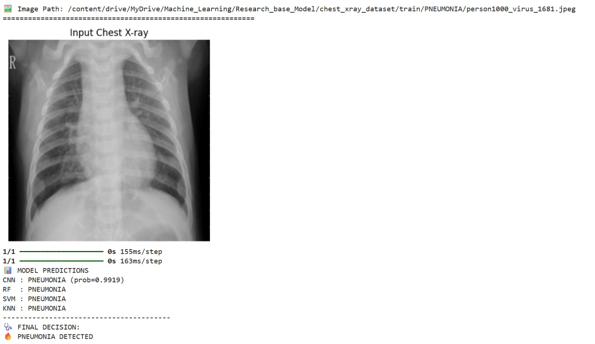
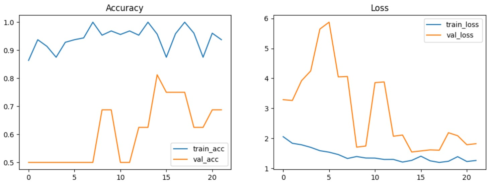
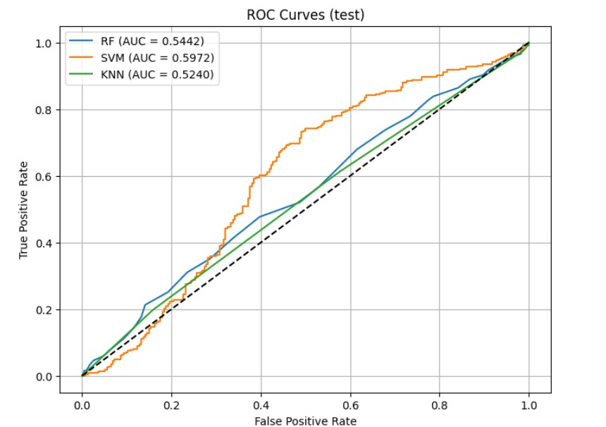
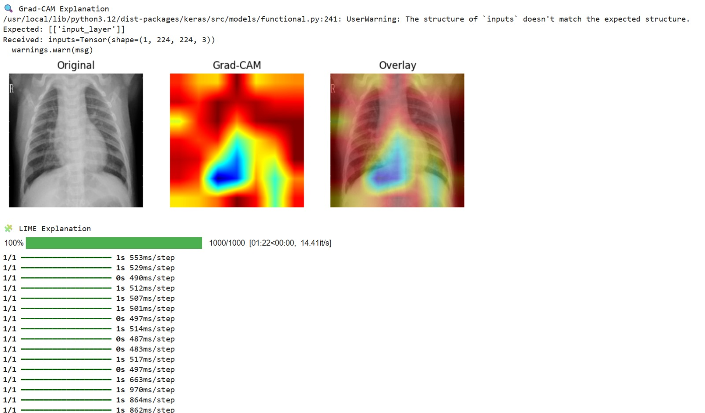
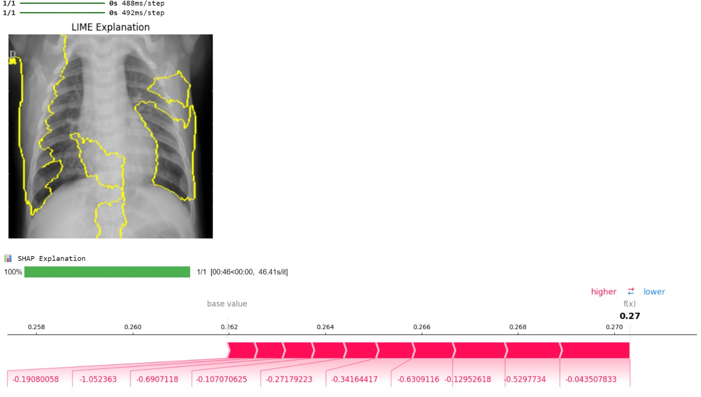

# 🩺 Pneumonia Detection using Deep Learning, Machine Learning & Explainable AI (XAI)

<p align="center">
  
  
  
  
  
</p>

---

## 🚀 Project Overview

This project presents a **hybrid AI-based medical diagnosis system** for detecting pneumonia from chest X-ray images.

Unlike traditional models, this system combines:

* 🧠 Deep Learning (CNN)
* 🤖 Machine Learning (RF, SVM, KNN)
* 🔍 Explainable AI (Grad-CAM, LIME, SHAP)

📌 The key strength is not only **high accuracy**, but also **interpretability**, making the system more reliable for healthcare applications.

---

## 🧠 Model Architecture

```id="arch1"
Input Image
     ↓
   CNN (Feature Extraction)
     ↓
 Feature Vector (Dense Layer)
     ↓
 ┌───────────────┬───────────────┬───────────────┐
 │ Random Forest │     SVM       │     KNN       │
 └───────────────┴───────────────┴───────────────┘
     ↓
 Majority Voting
     ↓
 Final Prediction (PNEUMONIA / NORMAL)
     ↓
 Explainable AI (Grad-CAM + LIME + SHAP)
```

---

## 🎯 Key Features

* ✅ Custom 22-layer CNN architecture
* ✅ Hybrid CNN + ML classification
* ✅ Majority voting system
* ✅ Fully integrated Explainable AI (XAI)
* ✅ Separate training & inference pipelines
* ✅ Ready for deployment

---

## 🔍 Explainable AI (XAI)

| Method      | Purpose                           |
| ----------- | --------------------------------- |
| 🔥 Grad-CAM | Highlights infected lung regions  |
| 🧩 LIME     | Explains important image segments |
| 📊 SHAP     | Shows feature contribution        |

---

## 📂 Dataset

Dataset used in this project:
This project uses the **Chest X-ray Pneumonia Dataset** from Kaggle:
🔗 [Chest X-ray Pneumonia Dataset](https://www.kaggle.com/datasets/paultimothymooney/chest-xray-pneumonia)

**Details:**

* Total Images: 5,856
* Classes: NORMAL, PNEUMONIA
* Format: JPEG

* Chest X-ray dataset (Pneumonia vs Normal)
* Structured as:

```
train/
 ├── NORMAL/
 └── PNEUMONIA/

val/
 ├── NORMAL/
 └── PNEUMONIA/

test/
 ├── NORMAL/
 └── PNEUMONIA/
```

---


## 🖼️ Sample Visualization 

> 💡 Replace with your generated outputs

### ML and DL Model Ensemble


### Accuracy and Loss


### ROC


### Grad-CAM and LIME Explanation


### SHAP Explanation


---

## ⚙️ Technologies Used

* Python
* TensorFlow / Keras
* Scikit-learn
* OpenCV / PIL
* LIME
* SHAP
* Google Colab

---

## 📁 Project Structure

```id="tree1"
Research_base_Model/
│
├── training_notebook.ipynb
├── pneumonia_xai_prediction.ipynb
│
├── final_cnn_model.h5
├── feature_extractor.h5
├── feature_scaler.pkl
├── cnn_rf_model.pkl
├── cnn_svm_model.pkl
├── cnn_knn_model.pkl
│
└── chest_xray_dataset/
```

---

## 🚀 Getting Started

### 🔹 1. Clone Repository

```bash id="cmd1"
git clone https://github.com/your-username/pneumonia-xai-project.git
cd pneumonia-xai-project
```

---

### 🔹 2. Install Dependencies

```bash id="cmd2"
pip install -r requirements.txt
```

---

### 🔹 3. Run Prediction

```python id="cmd3"
user_predict_and_explain("path_to_xray_image")
```

---

## 📊 Output

✔ Prediction (PNEUMONIA / NORMAL)
✔ Model comparison (CNN + RF + SVM + KNN)
✔ Grad-CAM heatmap
✔ LIME explanation
✔ SHAP feature importance

---

## 🧪 Results Summary

| Model     | Accuracy        |
| --------- | --------------- |
| CNN       | ~97%            |
| CNN + SVM | ~97%            |
| CNN + RF  | **~99% (Best)** |
| CNN + KNN | ~96%            |

---

## 💡 Applications

* 🏥 Clinical diagnosis support
* 🤖 AI-assisted radiology
* 📊 Medical imaging research
* 🎓 Academic projects

---

## 🔮 Future Improvements

* 🌐 Deploy using Streamlit / Flask
* 📱 Mobile-based diagnosis system
* 📊 Larger dataset integration
* ⚡ Real-time inference

---

## 👨‍💻 Author

**Tasikul Islam**
📘 Information and Communication Engineering & AI Research
🎓 Daffodil International University
---

## ⭐ Support

If you found this project helpful:
⭐ Star this repository
🔁 Share with others

---

## 📜 License

This project is for **educational and research purposes only**.


